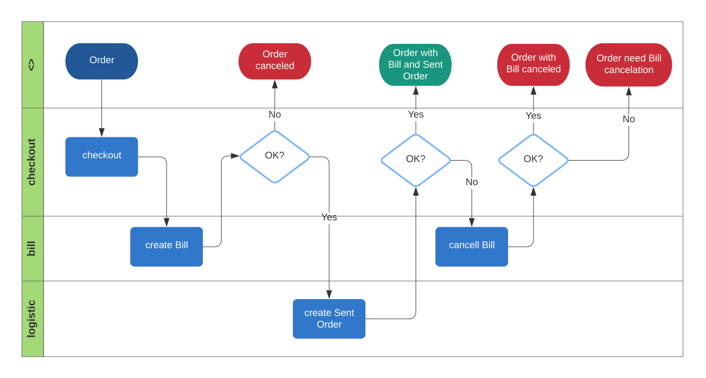
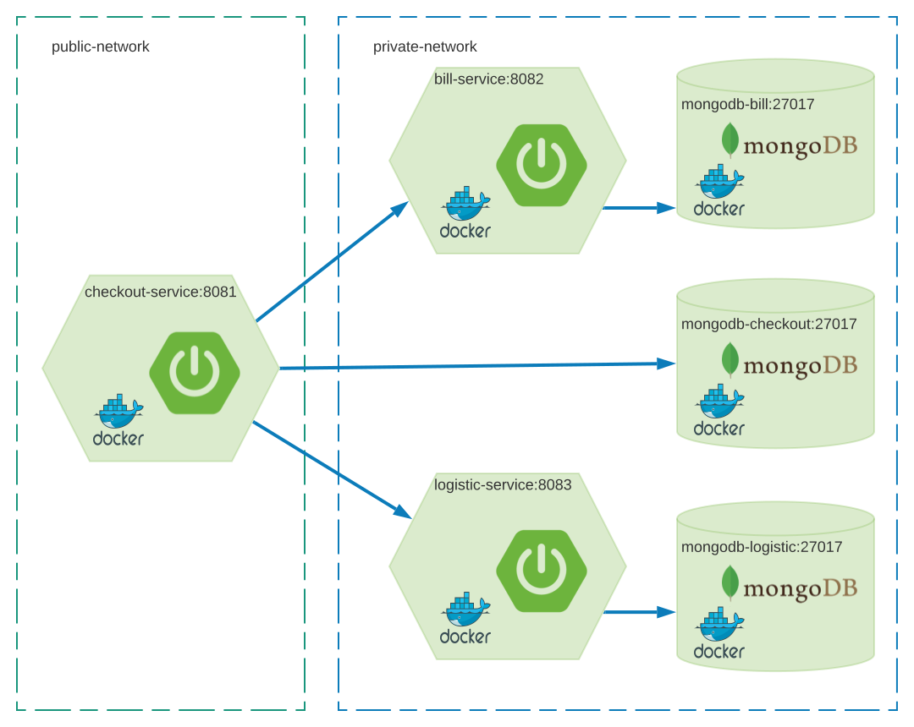

# Coding Challenge: Checkout
In this repository, you will find an example of the simulation of a checkout operation using a synchronous approach.
## Additional Assumptions
* Values in `Order` has been validated before consumption of the `checkout-service`:
  * Exists a client corresponding to `Order.clientId`
  * Exists a product corresponding to all products in `Order.products`
  * Products are available in stock of each product in `Order.products`
  * Exists `Order.direction` and is enough to logistic
* Persist is required
  * Persist `Order` is required
  * Persist `Bill` is required
  * Persist `Sent Order` is required
* When `Bill` creation fails then `Sent Order` won't be created
* When `Sent Order` creation fails then `Bill` will be canceled
  * When `Bill` cancelation fails then the `Order` allow identifying that `Bill` cancelation is required
* Checkout operation is based on the next diagram:


## Design Overview
In the next diagram is presented the hight level design of the solution.


### Design decisions

#### Single Database per service
Eliminate the impact of changes in the data structure of one service in any other.

#### Service instance per container
For scalability, encapsulation and isolation of each service.

#### AAA Pattern
AAA Pattern is used to structure the unit tests.

### Libraries & Frameworks

### Spring Framework
Spring Framework is used to facilitate development and take advantage of its features such as [Spring Initializr](https://start.spring.io/), [Spring Boot](https://spring.io/projects/spring-boot), and [Spring Data](https://spring.io/projects/spring-data).

### Maven
Maven is used for building projects and managing dependencies.

### MongoDB
MongoDB is used to persist the service data. MongoDB benefits scalability and transactionality.

### JUnit
JUnit is used to write and run the unit tests.

### Mockito
Mockito is used to simulate components and operations.

### Lombok
Lombok is used to reduce boilerplate code (Getters, Setters, Builders, logs...).

### DozerMapper
DozerMapper is used to reduce boilerplate code (Mapping).

### Springfox Swagger2
Used to generate Swagger API documentation.

### Springfox Swagger UI
Used to navigate in browser Swagger-generated API documentation.

### Javax Validation API
Javax Validation API used to validate incoming data.

## Prerequisites
* [JDK 1.8](https://www.oracle.com/co/java/technologies/javase/javase-jdk8-downloads.html)
* [Maven](https://maven.apache.org/download.cgi)
* [Docker for Windows version 19.03.8 and docker-compose version 1.25.5](https://docs.docker.com/docker-for-windows/) or [Docker Desktop](https://www.docker.com/products/docker-desktop)
## Execution steps

### 1. Build with Maven
  Go to path /bill and run 
  ```
  mvn clean install
  ```
  Go to path /logistic and run 
  ```
  mvn clean install
  ```
  Go to path /checkout and run 
  ```
  mvn clean install
  ```

### 2. Generate docker image from dockerfile
  Go to path /bill and run 
  ```sh
  docker build -f Dockerfile -t bill-service:0.0.1 .
  ```
  Go to path /logistic and run 
  ```sh
  docker build -f Dockerfile -t logistic-service:0.0.1 .
  ```
   Go to path /checkout and run 
  ```sh
  docker build -f Dockerfile -t checkout-service:0.0.1 .
  ```
  
### 3. Run with docker-compose
Go to path /docker and run 
```sh
docker-compose up -d
```
Note: ` -d` for runnin everything in the background.

The output should be like this:
```sh
Creating network "docker_private-network" with the default driver
Creating network "docker_public-network" with the default driver
Creating docker_mongodb-logistic_1 ... done
Creating docker_mongodb-bill_1     ... done
Creating docker_checkout-service_1 ... done
Creating docker_bill-service_1     ... done
Creating docker_logistic-service_1 ... done 
```
To stop run `docker-compose down`

### 4. Use

Sample of use with Curl
```sh
curl -X POST "http://localhost:8081/checkout" -H "accept: application/json" -H "Content-Type: application/json" -d "{ \"clientId\": 956341, \"date\": \"2020-07-03T20:35:01.897Z\", \"direction\": \"string\", \"products\": [ { \"cost\": 10.5, \"id\": 356974, \"quantity\": 3 }, { \"cost\": 15, \"id\": 356417, \"quantity\": 1 } ]}"
```
Sample of response code
```
200
```
Sample of Response body
```js
{
  "orderId": "dd1d8fee-df9c-4b2a-92cc-0735512054ea",
  "status": "SENT_ORDER_CREATED"
}
```
Sample of Response header
```js
connection: keep-alive 
content-type: application/json 
date: Fri, 03 Jul 2020 20:36:43 GMT 
keep-alive: timeout=60 
transfer-encoding: chunked 
```
It is possible to consume the service using Swagger UI following [http://localhost:8081/swagger-ui.html](http://localhost:8081/swagger-ui.html).

### Note
It is possible to execute the services locally, for this the access to the MongoDB schemas must be configured in the dev profile located in each of the projects ([bill](/bill), [logistic](/logistic), and [checkout](/checkout)`).

## Recommendations
 * Implement similar functionality using an asynchronous approach with tools like [ActiveMQ](http://activemq.apache.org/) or [Kafka](https://kafka.apache.org/) to improve scalability (Saga Pattern).
 * Use Kubernetes or other tools for container management.
 * Use an API GW tool (Traefik, Kong, ...) for access control, security and routing management.